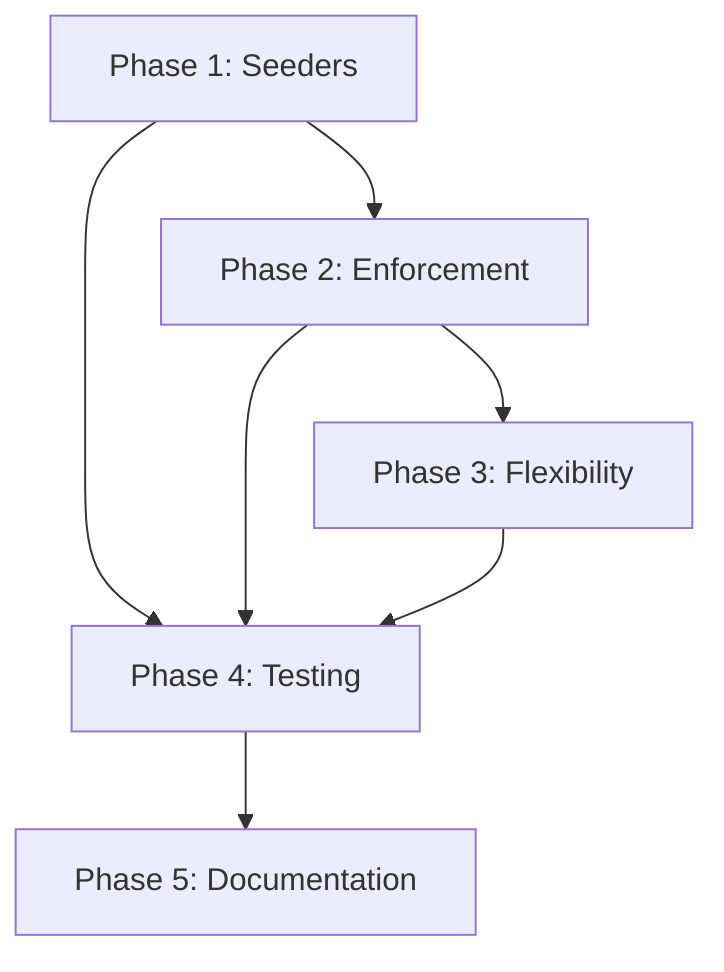

# Agrobrix Business Model Alignment Roadmap

## Overview

This roadmap outlines the comprehensive plan to align the Agrobrix codebase with the established business model. The platform operates as a property marketplace where users pay for access to contact information and property listings based on subscription plans, with role-based capabilities and add-on features.

## Business Model Summary

- **Buyers**: Pay for contact views with plan-based limits (e.g., 10 free contacts, ₹10 per additional)
- **Owners**: Pay for property listings with limits on number of listings and featured listings
- **Agents**: Have their own plans for contact access and client management
- **Add-ons**: Provide additional capabilities like extra listings or contacts
- **Payments**: Integrated via Razorpay with approval workflows for certain payment types

## Current State Analysis

### Strengths
- Role-based user system implemented
- Capability-based permission system in place
- Payment integration with Razorpay
- Property versioning and approval workflow
- Contact viewing limits partially enforced

### Gaps Identified
- Seeders do not include role-specific plans
- No add-on seeders for additional capabilities
- Incomplete enforcement of listing limits for owners
- Missing featured listing restrictions
- DatabaseSeeder not calling PlanSeeder

## Roadmap Phases

### Phase 1: Database and Seeder Updates (High Priority)

#### 1.1 Update PlanSeeder
**Objective**: Create role-specific plans that reflect the business model.

**Tasks**:
- Modify PlanSeeder to include plans for each role (buyer, owner, agent)
- Define appropriate capabilities for each plan type
- Set pricing, validity, and features based on provided business requirements

**Specific Changes**:
```php
// Buyer plans
[
    'name' => 'Starter',
    'role' => 'buyer',
    'price' => 249.00, // Offer price
    'original_price' => 499.00,
    'discount' => 50,
    'contacts_to_unlock' => 5,
    'validity_days' => 30,
    'persona' => 'Testing the waters for a specific plot.',
    'status' => 'active'
],
[
    'name' => 'Explorer',
    'role' => 'buyer',
    'price' => 399.00,
    'original_price' => 999.00,
    'discount' => 60,
    'contacts_to_unlock' => 15,
    'validity_days' => 90,
    'persona' => 'Serious buyers comparing multiple locations.',
    'status' => 'active'
],
[
    'name' => 'Investor',
    'role' => 'buyer',
    'price' => 749.00,
    'original_price' => 2499.00,
    'discount' => 70,
    'contacts_to_unlock' => 40,
    'validity_days' => 180,
    'persona' => 'Professional farmers or long-term investors.',
    'status' => 'active'
]

// Owner plans
[
    'name' => 'Basic',
    'role' => 'owner',
    'price' => 0.00,
    'features' => ['Standard Listing', '1 Photo', 'Engagement dashboard'],
    'capabilities' => ['max_listings' => 1],
    'validity_days' => 30,
    'status' => 'active'
],
[
    'name' => 'Premium',
    'role' => 'owner',
    'price' => 0.00, // 100% discount
    'original_price' => 99.00,
    'discount' => 100,
    'features' => ['Top of Search', '5 Photos', '"Who Viewed My Contact" Visibility'],
    'capabilities' => ['max_listings' => 3, 'max_featured_listings' => 1],
    'validity_days' => 30,
    'status' => 'active'
],
[
    'name' => 'Elite',
    'role' => 'owner',
    'price' => 249.00,
    'original_price' => 499.00,
    'discount' => 50,
    'features' => ['Highlighted Tag', 'Social Media Shoutout', 'Priority Support', 'Post 3 Properties'],
    'capabilities' => ['max_listings' => 3, 'max_featured_listings' => 3],
    'validity_days' => 90,
    'status' => 'active'
]

// Agent plans
[
    'name' => 'Basic',
    'role' => 'agent',
    'price' => 0.00,
    'features' => ['Standard Listing', '1 Photo', 'Engagement dashboard'],
    'capabilities' => ['max_contacts' => 5, 'max_listings' => 1],
    'validity_days' => 30,
    'status' => 'active'
],
[
    'name' => 'Professional',
    'role' => 'agent',
    'price' => 999.00,
    'original_price' => 1999.00,
    'discount' => 50,
    'features' => ['15 Property Posts', 'Analytics Dashboard'],
    'capabilities' => ['max_contacts' => 50, 'max_listings' => 15],
    'validity_days' => 90,
    'status' => 'active'
],
[
    'name' => 'Business',
    'role' => 'agent',
    'price' => 1999.00,
    'original_price' => 4999.00,
    'discount' => 60,
    'features' => ['50 Property Posts', 'Agent Profile Page'],
    'capabilities' => ['max_contacts' => 150, 'max_listings' => 50],
    'validity_days' => 180,
    'status' => 'active'
],
[
    'name' => 'Enterprise',
    'role' => 'agent',
    'price' => 3749.00,
    'original_price' => 14999.00,
    'discount' => 75,
    'features' => ['150 Property Posts', 'Verified Partner Badge'],
    'capabilities' => ['max_contacts' => 500, 'max_listings' => 150],
    'validity_days' => 360,
    'status' => 'active'
]
```

**Effort**: Medium
**Dependencies**: None
**Priority**: High

#### 1.2 Create AddonSeeder
**Objective**: Seed add-on capabilities for extended features.

**Tasks**:
- Create database/seeders/AddonSeeder.php
- Define add-ons like "Extra Contacts", "Featured Listing Boost"
- Set pricing and capability modifiers

**Example Add-ons**:
- Extra 50 contacts: ₹499, capabilities: ['max_contacts' => 50]
- Featured listing extension: ₹199, capabilities: ['max_featured_listings' => 5]

**Effort**: Low
**Dependencies**: PlanSeeder update
**Priority**: High

#### 1.3 Update DatabaseSeeder
**Objective**: Ensure all seeders are called during database setup.

**Tasks**:
- Add PlanSeeder::class to DatabaseSeeder
- Add AddonSeeder::class to DatabaseSeeder
- Verify seeder execution order

**Effort**: Low
**Dependencies**: PlanSeeder and AddonSeeder creation
**Priority**: High

### Phase 2: Feature Implementation and Enforcement (Medium Priority)

#### 2.1 Enforce Owner Listing Limits
**Objective**: Prevent owners from exceeding their plan's listing limits.

**Tasks**:
- Update Owner/PropertyController to check max_listings capability before allowing new listings
- Implement checks in property creation and approval workflows
- Add user-friendly error messages when limits are reached

**Current Status**: Partially implemented in some areas
**Effort**: Medium
**Dependencies**: Updated seeders
**Priority**: Medium

#### 2.2 Implement Featured Listing Restrictions
**Objective**: Control featured listings based on plan capabilities.

**Tasks**:
- Add capability checks in property featuring functionality
- Update Property model to validate featured status against user capabilities
- Implement payment flows for additional featured slots if needed

**Current Status**: Basic structure exists, needs enforcement
**Effort**: Medium
**Dependencies**: Owner listing limits
**Priority**: Medium

#### 2.3 Enhance Agent Capabilities
**Objective**: Ensure agents have appropriate limits and features.

**Tasks**:
- Verify agent plan enforcement in contact viewing
- Implement agent-specific features (lead management, client limits)
- Add agent dashboard restrictions based on plan

**Current Status**: Basic contact limits implemented
**Effort**: Low
**Dependencies**: Updated seeders
**Priority**: Medium

#### 2.4 Add Payment Approval Workflow
**Objective**: Implement admin approval for certain payment types.

**Tasks**:
- Complete UPI static payment approval system
- Add admin notification and approval interface
- Implement payment status tracking and notifications

**Current Status**: Framework exists, needs completion
**Effort**: High
**Dependencies**: Payment model updates
**Priority**: Medium

### Phase 3: System Flexibility and Future-Proofing (Low Priority)

#### 3.1 Capability System Enhancement
**Objective**: Make the capability system more flexible for future additions.

**Tasks**:
- Review CapabilityTrait for extensibility
- Add validation for capability keys
- Implement capability inheritance or stacking logic if needed

**Effort**: Low
**Dependencies**: Phase 1 and 2 completion
**Priority**: Low

#### 3.2 Admin Configuration Interface
**Objective**: Allow admins to modify plan capabilities without code changes.

**Tasks**:
- Enhance admin plan management interface
- Add capability editing in admin panel
- Implement plan versioning for changes

**Effort**: High
**Dependencies**: Phase 2 completion
**Priority**: Low

### Phase 4: Testing and Validation (High Priority)

#### 4.1 Seeder Testing
**Objective**: Validate that seeders create correct data.

**Tasks**:
- Run seeders and verify database contents
- Test plan capability calculations
- Validate user capability aggregation

**Effort**: Low
**Dependencies**: Phase 1 completion
**Priority**: High

#### 4.2 Business Logic Testing
**Objective**: Ensure limits and payments work correctly.

**Tasks**:
- Test contact viewing limits for all roles
- Verify property listing restrictions
- Test payment flows and approvals
- Validate capability combinations with add-ons

**Effort**: Medium
**Dependencies**: Phase 2 completion
**Priority**: High

#### 4.3 Integration Testing
**Objective**: Test end-to-end user workflows.

**Tasks**:
- Buyer contact purchase flow
- Owner property listing with limits
- Agent lead management
- Admin approval workflows

**Effort**: High
**Dependencies**: Phase 3 completion
**Priority**: High

### Phase 5: Documentation and Deployment (Low Priority)

#### 5.1 Update Technical Documentation
**Objective**: Reflect business model alignment in docs.

**Tasks**:
- Update API.md with plan and capability details
- Document seeder data and business rules
- Add capability system documentation

**Effort**: Low
**Dependencies**: All phases
**Priority**: Low

#### 5.2 Deployment Checklist
**Objective**: Ensure smooth deployment of changes.

**Tasks**:
- Create migration scripts for existing data
- Update deployment documentation
- Plan rollback procedures

**Effort**: Low
**Dependencies**: All phases
**Priority**: Low

## Dependencies and Critical Path



## Risk Assessment

### High Risk
- Payment approval workflow complexity
- Existing data migration during seeder updates

### Medium Risk
- Capability system changes affecting existing functionality
- Admin interface modifications

### Low Risk
- Documentation updates
- Additional validation rules

## Success Metrics

- All seeders run without errors
- Users cannot exceed plan limits
- Payment flows work for all scenarios
- Admin can manage plans and capabilities
- System remains flexible for future changes

## Timeline Estimate

- Phase 1: 1-2 weeks
- Phase 2: 2-3 weeks
- Phase 3: 1 week
- Phase 4: 1-2 weeks
- Phase 5: 0.5 week

Total: 5.5-8.5 weeks depending on testing complexity.

## Next Steps

1. Begin with Phase 1 seeder updates
2. Implement and test limit enforcement
3. Enhance flexibility features
4. Comprehensive testing
5. Documentation updates

This roadmap ensures the codebase fully supports the business model while maintaining flexibility for future enhancements.